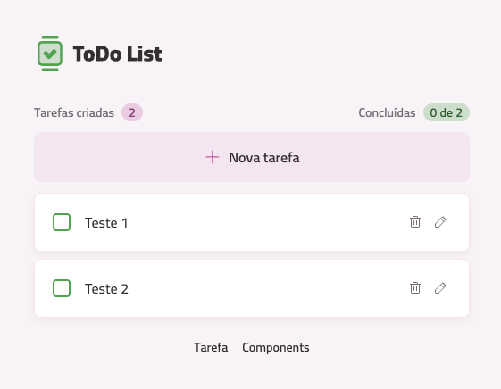

# React To Do

Este projeto foi desenvolvido para estudo da biblioteca React.

## Tecnologias utilizadas:

* Node 22.17.0
* Vite
* React
* React-router
* Typescript
* Tailwind CSS

Durante este desenvolvimento foram abordados conceitos como:

* Roteamento, utilizando react-router.
* Uso de hooks - useState, useEffect e hooks customizados
* Componentização - componentes atômicos e core components

Este projeto foi desenvolvido durante as atulas do curso de React, da Rocketseat.